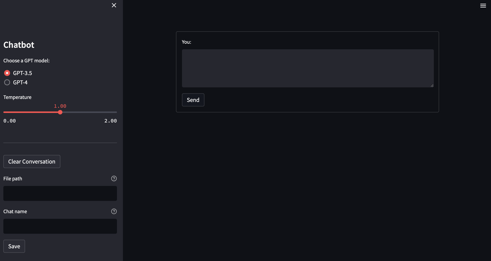

# LLM Chat UI
A Streamlit Chat UI for LLMs.

LLMs supported:
* GPT 3.5 
* GPT 4

The code in this repo is inspired by Streamlit's [Build conversational apps tutorial](https://docs.streamlit.io/knowledge-base/tutorials/build-conversational-apps). 

# Instructions

1. Install [Docker](https://docs.docker.com/engine/install/). 
2. Get an OpenAI API key from [here](https://platform.openai.com/account/api-keys).
3. Clone the repo.
```
gh repo clone ankur-manikandan/llm-chat-ui
```
4. On your local machine change directory to `llm-chat-ui`. Example:
```
cd ~/Documents/github/llm-chat-ui
```
5. Create a `.env` file in the `llm-chat-ui` directory. We will use this file to store the OpenAI API key. 
    * Create a `.env` file.
    ```
    vi .env
    ```
    * Add the API key. Please use the same environment variable name.
    ```
    OPENAI_API_KEY="enter-your-key-here"
    ```
    * Save the `.env` file.
6. You are ready to build the docker container.
```
docker build -t container-name .
```
Example:
```
docker build -t llm-ui .
```
7. Run the container.
```
docker run -p 8501:8501 container-name
```
Example:
```
docker run -p 8501:8501 llm-ui
```
`-p` maps port `8501` of the Docker container to port `8501` on your local machine, allowing you to access the Streamlit app in your browser at `http://localhost:8501`.

If you would like to mount a directory from your local machine to a Docker container, you can use the `-v` or `--volume` flag in the `docker run` command.
```
docker run -p 8501:8501 -v /path/to/local/directory:/path/in/container container-name
```
Example:
```
docker run -p 8501:8501 -v ~/Documents/github/llm-chat-ui/:/app llm-ui
```
In the above command, we are assuming that the working directory of the docker container is `/app`.

8. Wait for the docker container to finish building. Once you see the message below, the container has been successfully built.
```
You can now view your Streamlit app in your browser.

  Network URL: http://localhost:8501
```
9. Open your browser and enter
```
http://localhost:8501/
```
10. If everything ran successfully, you should see the Streamlit app load.
